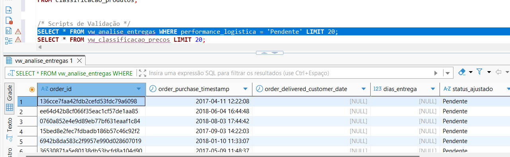
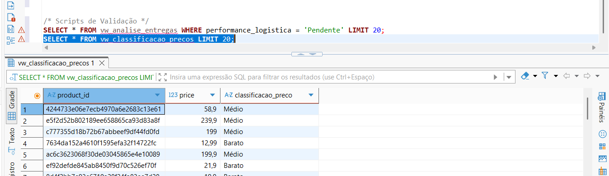

# 📊 Análise de Dados de E-commerce (Olist) com SQL

Este projeto consiste em uma análise exploratória e estratégica de dados reais de e-commerce brasileiro (Dataset público da Olist). 

O objetivo foi simular um cenário real "End-to-End" de **Business Intelligence**, onde atuei desde a engenharia de dados (limpeza e transformação) até a atuação como **Analytics Engineer**, criando regras de negócio complexas e arquitetura de dados para a diretoria.

## 🛠️ Ferramentas Utilizadas
* **Linguagem:** SQL (MySQL)
* **Interface (IDE):** DBeaver / VS Code
* **Controle de Versão:** Git/GitHub
* **Conceitos:** Data Cleaning, Window Functions, CTEs, Views e Data Enrichment.
* **Dataset:** [Brazilian E-Commerce Public Dataset by Olist](https://www.kaggle.com/datasets/olistbr/brazilian-ecommerce)

---

## 🚀 Etapas do Projeto

O projeto foi dividido em níveis de complexidade, simulando a evolução de maturidade de dados de uma empresa:

### 1. Engenharia de Dados (Data Engineering)
Antes de analisar, foi necessário preparar o terreno. Os dados brutos apresentavam inconsistências de tipagem (datas como texto) e campos vazios.
* **Investigação:** Identificação de colunas de datas importadas como `STRING/VARCHAR`.
* **Tratamento de Erros:** Correção de falhas onde strings vazias (`''`) impediam a conversão para data. Uso de `UPDATE` com `CASE` ou filtros para transformar vazios em `NULL`.
* **Alteração de Schema:** Uso de `ALTER TABLE` e `MODIFY` para estruturar colunas como `DATETIME` oficial.

### 2. Análise de Negócio (Business Questions)
Resolução de 5 "missões" estratégicas solicitadas pela diretoria fictícia:
* **Auditoria de Pedidos:** Levantamento de volumetria e status dos pedidos.
* **Análise Financeira:** Cálculo do faturamento total histórico (Vendas + Fretes).
* **Performance Logística:** Análise de *Basket Size* (Média de itens por pedido) utilizando `COUNT(DISTINCT)`.
* **Série Temporal (Time Series):** Análise da evolução de vendas por ano (2016-2018) utilizando extração de datas (`YEAR`).
* **Pareto e Outliers:** Identificação de pedidos de alto valor (acima de R$ 5.000,00) utilizando filtros agregados (`HAVING`).

### 3. Business Intelligence Avançado (Rankings & Views)
Foco na criação de produtos de dados para consumo de dashboards e relatórios gerenciais.
* **Criação de Views:** Encapsulamento de consultas complexas (`CREATE VIEW`) para facilitar o uso por ferramentas de visualização (ex: Power BI).
* **Window Functions:** Utilização de `DENSE_RANK()` e `RANK()` para classificar vendedores e produtos "Best Sellers" de forma justa, sem perder dados em casos de empate.

### 4. Analytics Engineering (Regras de Negócio & SLA)
A fase mais avançada, implementando lógica de negócio sem alterar os dados originais (*Non-destructive approach*).
* **CTEs (Common Table Expressions):** Uso de `WITH` para criar códigos modulares e organizados.
* **Cálculo de SLA (Logística):** Implementação de lógica condicional (`CASE WHEN`) para classificar entregas em "Rápido" (< 7 dias), "Normal" e "Lento", identificando gargalos logísticos.
* **Segmentação de Preços (Marketing):** Criação de clusters de produtos ("Barato", "Médio", "Premium") para análise de mix de portfólio.

---

## 📈 Principais Insights (Exemplos)
* **Atacado vs Varejo:** Identificação de pedidos "Atacadistas" com mais de 20 itens, destoando da média unitária.
* **SLA Logístico:** Pedidos com status "Pendente" (NULL) foram tratados isoladamente para não distorcer a métrica de atrasos ("Lento").
* **Prevenção:** Mapeamento de outliers financeiros para auditoria de fraude ou clientes VIP.

---

## 📸 Galeria do Projeto
Abaixo, algumas evidências da execução do código e a documentação auxiliar.

### 📂 Dicionário de Dados (Documentação)

### 🛠️ Engenharia de Dados (Correção e Alteração)
*Log de erro ao tentar alterar tipos sem limpeza prévia:*

*Sucesso após limpeza dos dados:*

### 📊 Resultados das Queries (Fase Inicial)
*Missão 1 - Auditoria de Status:*

*Missão 3 - Cálculo de Média de Itens:*

*Missão 5 - Identificação de Clientes de Alto Valor:*

### 🧠 Analytics Engineering (Novas Implementações)
*Classificação de SLA Logístico (Rápido/Normal/Lento) usando CTEs:*

*Segmentação de Preços (Marketing) via View:*

---

## 📂 Estrutura do Repositório
O projeto está organizado em níveis de complexidade técnica:

* `analise_olist_logistica.sql`: **(Nível Jr)** Script de limpeza, correção de tipagem e tratamento de NULLs.
* `02_analise_bi_rankings.sql`: **(Nível Pleno)** Consultas focadas em BI, auditoria e rankings com Window Functions.
* `03_analytics_engineering.sql`: **(Nível Sênior)** Script final contendo a arquitetura de Views, CTEs e regras de negócio (SLA e Segmentação).

---
**Autor:** Gustavo Tonato
*Projeto desenvolvido para fins de estudo e portfólio.*