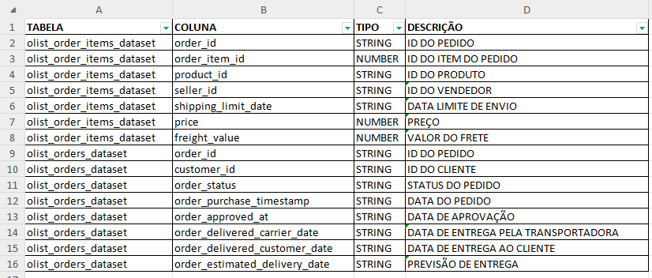
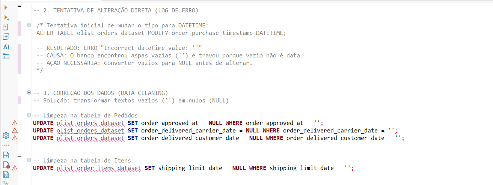
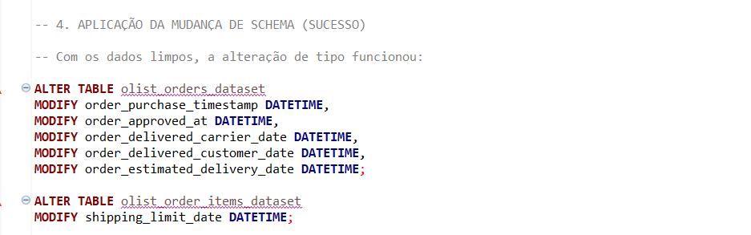
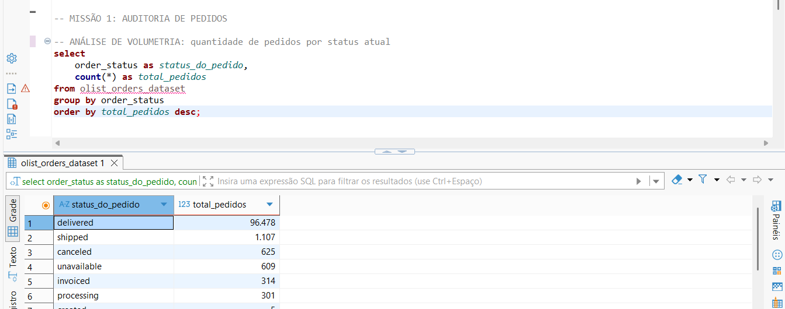
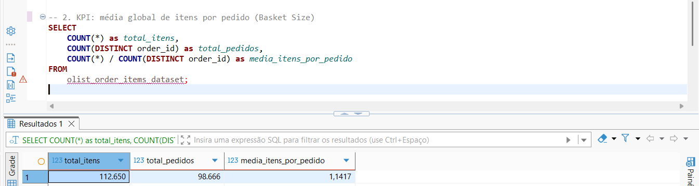
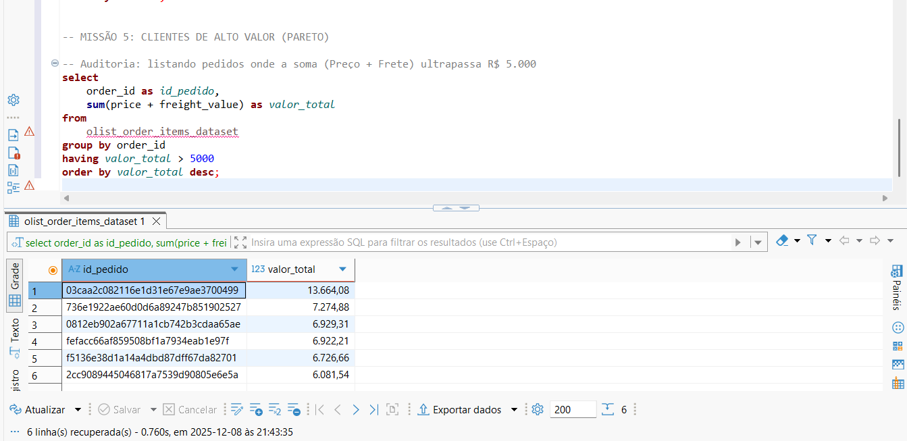

# 📊 Análise de Dados de E-commerce (Olist) com SQL

Este projeto consiste em uma análise exploratória e estratégica de dados reais de e-commerce brasileiro (Dataset público da Olist). 

O objetivo foi simular um cenário real de **Business Intelligence**, onde atuei desde a engenharia de dados (limpeza e transformação) até a geração de KPIs de negócio para a diretoria.

## 🛠️ Ferramentas Utilizadas
* **Linguagem:** SQL (MySQL)
* **Interface (IDE):** DBeaver
* **Controle de Versão:** Git/GitHub
* **Dataset:** [Brazilian E-Commerce Public Dataset by Olist](https://www.kaggle.com/datasets/olistbr/brazilian-ecommerce)

## 🚀 Etapas do Projeto

### 1. Engenharia de Dados (Data Engineering)
Antes de analisar, foi necessário preparar o terreno. Os dados brutos apresentavam inconsistências de tipagem (datas como texto) e campos vazios.
* **Investigação:** Identificação de colunas de datas importadas como `STRING/VARCHAR`.
* **Tratamento de Erros:** Correção de falhas onde strings vazias (`''`) impediam a conversão para data. Uso de `UPDATE` com `CASE` ou filtros para transformar vazios em `NULL`.
* **Alteração de Schema:** Uso de `ALTER TABLE` e `MODIFY` para estruturar colunas como `DATETIME` oficial.

### 2. Análise de Negócio (Business Questions)
Resolução de 5 "missões" estratégicas solicitadas pela diretoria fictícia:

* **Auditoria de Pedidos:** Levantamento de volumetria e status dos pedidos.
* **Análise Financeira:** Cálculo do faturamento total histórico (Vendas + Fretes).
* **Performance Logística:** Análise de *Basket Size* (Média de itens por pedido) utilizando `COUNT(DISTINCT)`.
* **Série Temporal (Time Series):** Análise da evolução de vendas por ano (2016-2018) utilizando extração de datas (`YEAR`).
* **Pareto e Outliers:** Identificação de pedidos de alto valor (acima de R$ 5.000,00) utilizando filtros agregados (`HAVING`).

## 📈 Principais Insights (Exemplos)
* Identificação de pedidos "Atacadistas" com mais de 20 itens em uma única transação.
* A média de itens por pedido é próxima de 1, indicando um comportamento de compra unitária predominante.
* Mapeamento de outliers financeiros para auditoria de fraude ou clientes VIP.

---

## 📸 Galeria do Projeto
Abaixo, algumas evidências da execução do código e a documentação auxiliar.

### 📂 Dicionário de Dados (Documentação)

### 🛠️ Engenharia de Dados (Correção e Alteração)
*Log de erro ao tentar alterar tipos sem limpeza prévia:*

*Sucesso após limpeza dos dados:*

### 📊 Resultados das Queries (Missões)
*Missão 1 - Auditoria de Status:*

*Missão 3 - Cálculo de Média de Itens:*

*Missão 5 - Identificação de Clientes de Alto Valor:*

---

## 📂 Estrutura do Repositório
* `analise_olist_logistica.sql`: Script contendo todo o processo documentado, desde a limpeza até as queries finais.

---
**Autor:** Gustavo Tonato
*Projeto desenvolvido para fins de estudo e portfólio.*